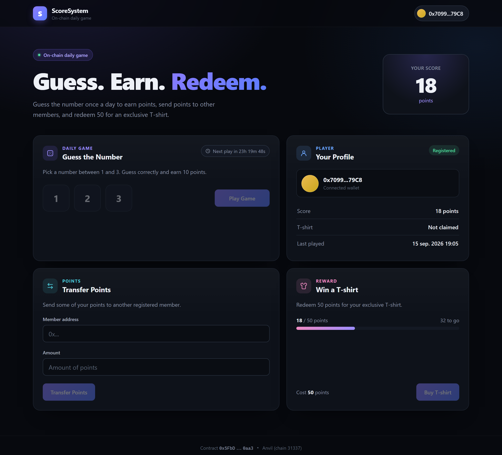

# ScoreSystem

[](https://github.com/Andkull/ScoreSystem/actions/workflows/test.yml)

An on-chain daily guessing game. Players register, guess a number once every 24 hours to earn points, send points to other members, and redeem 50 points for an exclusive T-shirt. The rules live in a Solidity smart contract; a React frontend lets you play the whole game from the browser with MetaMask.



## Features

- **Daily game** – guess a number from 1 to 3; a correct guess earns 10 points. A live countdown shows when you can play again.
- **Point transfers** – send points to any registered member, with the address, membership and balance checked as you type.
- **Rewards** – a progress bar tracks your way to 50 points, then redeem them for a T-shirt (one per player).
- **Admin panel** – shown only to the contract admin, for awarding points to members.
- **Readable errors** – contract reverts ("Cooldown active", "Not enough points"), wallet rejections and wrong-network errors appear as plain messages in the UI.

## Tech stack

| Layer | Tools |
|---|---|
| Smart contract | Solidity 0.8.28, Foundry (Forge, Anvil, Cast) |
| Frontend | React 19, TypeScript, Vite, viem |
| Wallet | MetaMask (any EIP-1193 wallet) |
| CI | GitHub Actions: `forge fmt`, build and tests on every push |

## Project structure

```
contracts/                 Foundry project
  src/ScoreSystem.sol      The game contract
  test/ScoreSystem.t.sol   Unit tests (access control, transfers, cooldown with time warps)
  script/Deploy.s.sol      Deploy script
frontend/                  React app
  src/blockchain/          viem clients, ABI, contract calls, error formatting
  src/hooks/               Wallet, player data, transactions, contract config
  src/components/          One component per card (game, transfer, reward, admin)
docs/                      README assets
```

## Run it locally

**Prerequisites:** [Foundry](https://book.getfoundry.sh/getting-started/installation), Node.js 20.19+ or 22.12+, and the MetaMask browser extension.

1. **Start a local chain** in its own terminal:

   ```bash
   anvil
   ```

   Anvil prints ten funded test accounts with their private keys. Keep the terminal open.

2. **Deploy the contract** in a second terminal:

   ```bash
   cd contracts
   forge script script/Deploy.s.sol --rpc-url http://127.0.0.1:8545 --broadcast --unlocked --sender 0xf39Fd6e51aad88F6F4ce6aB8827279cffFb92266
   ```

   On a fresh Anvil node this deploys to `0x5FbDB2315678afecb367f032d93F642f64180aa3`, the address the frontend expects. The sender (Anvil account #0) becomes the admin.

3. **Start the frontend:**

   ```bash
   cd frontend
   npm ci
   npm run dev
   ```

   Open http://localhost:5173.

4. **Set up MetaMask:**
   - Add a network with RPC URL `http://127.0.0.1:8545` and chain ID `31337`.
   - Import one or more Anvil accounts using the private keys from step 1. Account #0 sees the admin panel.

> Anvil's keys are public test keys. Never send real funds to them or use them on a real network.

Restarting Anvil wipes the chain, so redeploy (step 2) afterwards. If MetaMask then reports nonce errors, clear its activity data for the account (Settings → Advanced → Clear activity tab data).

## Testing

From the repository root:

```bash
(cd contracts && forge test -vvv)                  # contract unit tests
(cd frontend && npm run lint && npm run build)     # lint, typecheck and production build
```

## How it works

- **Reads** go through a viem public client straight to the node, so the page can show the T-shirt cost and cooldown before a wallet connects.
- **Writes** follow one flow in `src/blockchain/contractFunctions.ts`: simulate the call first so a revert comes back with the contract's reason before the wallet prompts, send it through the wallet, wait for the receipt, then refresh the player's data. Buttons stay in a pending state until that refresh lands, so they never re-enable against stale data.
- **Game results** are read from the `GamePlayed` event in the transaction receipt.
- **`playGame` uses a fixed gas limit.** The outcome depends on the block timestamp, so gas estimation can run the cheaper losing path while the mined transaction takes the more expensive winning one and runs out of gas.
- **The admin panel** is shown when the connected account matches `admin()`. The contract enforces `onlyAdmin` regardless.

## Limitations

- **Randomness is not secure.** The winning number comes from `block.timestamp` and the sender's address, which a validator could influence. A production version would use a verifiable randomness source such as Chainlink VRF.
- **Local only.** The frontend targets Anvil (chain 31337) at a fixed contract address in `frontend/src/blockchain/contract.ts`.
- **No live updates.** The page refreshes after your own transactions and on account switches; changes made by others appear after a reload.
